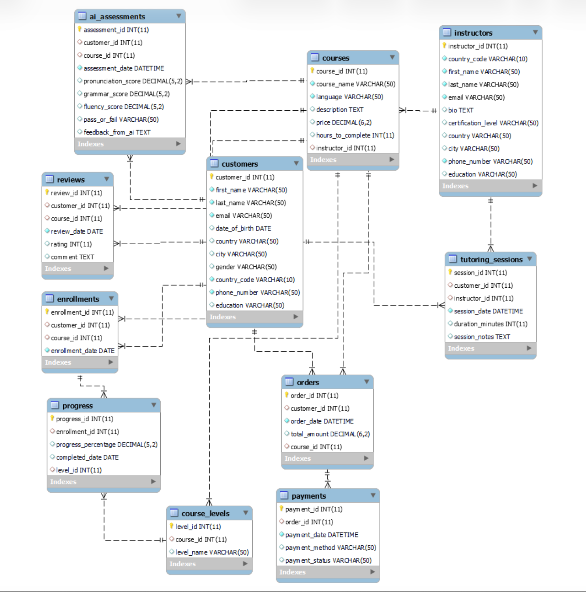
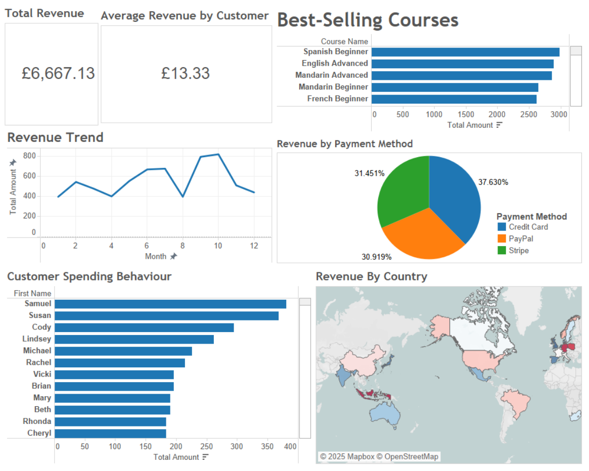
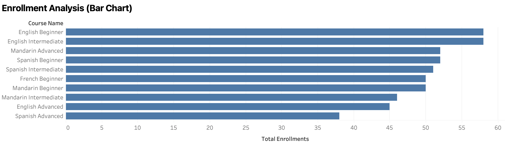
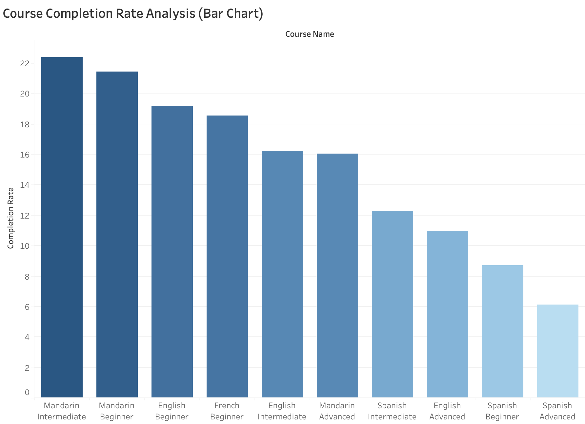
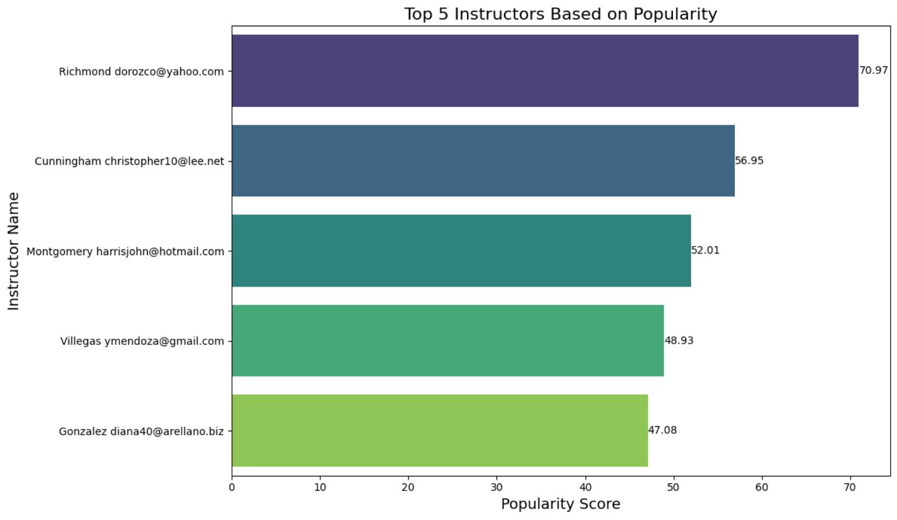

# LexGo — Data Management & Business Analytics

A group data management and business analytics project for a hypothetical online language-learning platform, combining relational database design, synthetic data, SQL analysis, and Tableau visualisation to generate actionable business insights.

## Project Overview

LexGo is a hypothetical online language-learning platform offering interactive courses, AI-powered feedback, live tutoring, and certification across multiple languages and proficiency levels.

The project developed a structured data environment to support business decision-making across three key areas:

- **Sales & Revenue** — course performance, revenue trends, customer spending, and payment outcomes
- **Student Progress** — course enrolment, tutoring participation, and completion rates
- **Instructor Performance** — tutoring demand, course ratings, and instructor contribution

## Business Objectives

The analysis was designed to support four business objectives:

1. Improve revenue stability and identify high-performing courses
2. Improve course completion and learner engagement
3. Evaluate and optimise instructor performance
4. Identify payment failures and refund-related issues

## Tools & Technologies

- **SQL / SQLite** — relational database implementation and business analysis
- **Tableau** — data visualisation and business reporting
- **Excel** — synthetic dataset storage and preparation
- **Relational Data Modelling** — ERD, primary/foreign keys, and table relationships
- **Synthetic Data** — simulated customer, course, payment, progress, and tutoring activity

## Database Design

The relational database models the operational activities of the LexGo platform, including customers, instructors, courses, enrolments, learning progress, tutoring sessions, AI assessments, orders, payments, and reviews.

The schema uses primary and foreign keys to connect operational processes such as course enrolment, payment transactions, student progress, and instructor interactions.



The database schema is available in [`sql/create_database.sql`](sql/create_database.sql).

## Business Analysis

SQL queries were used to transform transactional and operational data into business metrics covering customer behaviour, course performance, payment outcomes, learning progression, and instructor performance.

The analysis queries are available in [`sql/business_analysis.sql`](sql/business_analysis.sql).

### 1. Sales & Revenue

The sales analysis examined revenue trends, best-selling courses, customer spending behaviour, geographic revenue contribution, and payment methods.



Key observations included:

- Beginner-level courses represented an important source of demand.
- English and Mandarin courses were among the key revenue contributors.
- Revenue fluctuated over time, indicating potential seasonality and changes in customer engagement.
- Failed and refunded transactions represented opportunities to improve payment processing and refund management.

### 2. Student Progress & Engagement

Course enrolment, tutoring participation, and learning progress were analysed to understand how effectively learners progressed through the platform.



The analysis showed strong demand for English Beginner and English Intermediate courses, while advanced-level courses generally attracted fewer enrolments.



Using a **60% progress threshold**, Mandarin Beginner recorded the highest observed completion rate at approximately **38.57%**, while Spanish Beginner recorded the lowest at approximately **18.84%**.

The results suggest that course popularity does not necessarily translate into stronger completion, highlighting opportunities to improve learner retention and progression.

### 3. Instructor Performance

Instructor-related metrics were analysed using tutoring activity, learner reach, course ratings, and revenue contribution.



This analysis provides a basis for identifying high-performing instructors, understanding tutoring demand, and supporting instructor resource allocation.

## Actionable Recommendations

Based on the analysis, three areas were identified for business improvement:

1. **Improve payment performance**  
   Investigate recurring payment failures and refund patterns to improve transaction success and review refund policies.

2. **Increase learner engagement and progression**  
   Use personalised learning, AI-driven recommendations, and engagement features to support learners in courses with weaker completion rates.

3. **Optimise instructor allocation**  
   Use instructor performance metrics to recognise strong performers and allocate effective instructors to courses with weaker learner outcomes.

## My Contribution

This was a group data management project.

My individual contribution focused on the **business analysis communication and reporting stage**:

- Consolidated SQL analysis and Tableau outputs into the **Business Insights and Report** section of the final report.
- Interpreted findings across sales, student progress, and instructor performance and connected them to business objectives.
- Developed the final presentation to communicate analytical findings, business implications, and actionable recommendations.
- Structured the analytical story from business goals and data outputs through to insights and recommended actions.

## Repository Structure

```text
Lexgo-Data-Management-Analysis/
│
├── data/
│   └── lexgo_synthetic_data.xlsx
│
├── images/
│   ├── database_design_erd.png
│   ├── sales_revenue_dashboard.png
│   ├── enrollment_analysis.png
│   ├── completion_rate.png
│   └── instructor_performance.png
│
├── presentation/
│   └── lexgo_business_insights_presentation.pdf
│
├── sql/
│   ├── create_database.sql
│   └── business_analysis.sql
│
└── README.md
